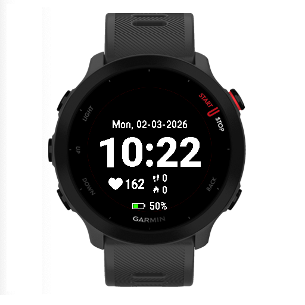
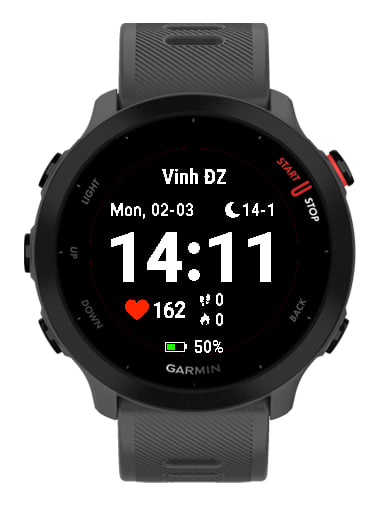

# Garmin Simple Face

Watch face dành cho **Garmin Forerunner 55**.

## 📱 Tính năng hiển thị

Phiên bản v1

Màn hình bao gồm:

- 🕒 Thời gian
- ❤️ Nhịp tim (Heart Rate)
- 👣 Bước chân (Steps)
- 🔥 Calories
- 🔋 Trạng thái pin

Phiên bản v2

- 🕒 Bổ sung lịch âm

---

## 🖼 Demo

Demo v1



Demo v2



---

## 🛠 Build

Dự án được phát triển bằng **Garmin Connect IQ (Monkey C)**.

Có thể build bằng:

```bash
monkeyc -f monkey.jungle -o simpleface.prg -d fr55