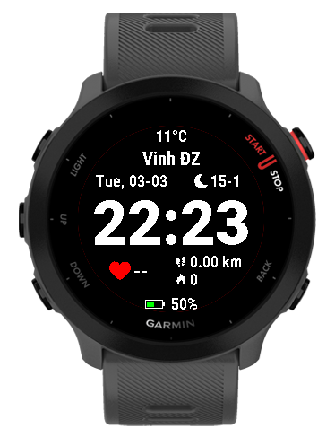

# Garmin Simple Face

Watch face dành cho **Garmin Forerunner 55**.

## 📱 Tính năng hiển thị

Phiên bản v1

Màn hình bao gồm:

- 🕒 Thời gian
- ❤️ Nhịp tim (Heart Rate)
- 👣 Bước chân (Steps)
- 🔥 Calories
- 🔋 Trạng thái pin

Phiên bản v2

- 🕒 Bổ sung lịch âm

Phiên bản v3

- 🔥 Thêm nhiệt độ
- 👣 Khoảng cách di truyển

---

## 🖼 Demo

Demo v1

Demo v2

Demo v3

---

## 🛠 Build

Dự án được phát triển bằng **Garmin Connect IQ (Monkey C)**.

Sử dụng SDK 8.4.1, level API 3.4.0

build .iq file

monkeyc -e -f monkey.jungle -o app.iq -y developer_key
